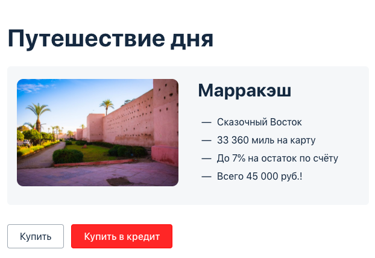
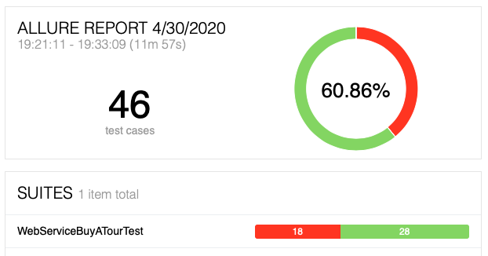

# Отчет о проведенном тестировании
***        
## **Краткое описание**         
Проведена автоматизация тестирования комплексного сервиса,
представляющего из себя веб-приложение "Путешествие дня", взаимодействующего
с СУБД и API банка.        
       
***         
## **Количество тест-кейсов, % успешных / не успешных**        
Разработано и проведено 44 тестовых случаев.
Из них 59,09% (26 авто-тестов) оказались успешными, и 40,91% (18 авто-тестов) - неуспешными.     
   
***            
## **Общие рекомендации**        
Результаты проведенного тестирования показали, что требуется значительная доработка 
веб-сервиса "Путешествие дня" и его взаимодействия с СУБД и API банка. Основные рекомендации по доработкам сервиса
приведены ниже.
### 1. Рекомендации по дизайну приложения
* Исправить заголовок страницы приложения. В настоящей версии заголовок страницы приложения _AQA: Заявка на карту_.    
* Исправить название города путешествия. Правильное название города _Марракеш_.   
* В описании путешествия исправить направление путешествия до города _Марракеш_ с _-Сказочный Восток_ на _-Сказочная Африка_.
### 2. Рекомендации по заполнению полей веб-формы (рекомендации актуальны при активации веб-формы кнопкой _Купить_ и кнопкой _Купить в кредит_)  
* **Поле _Месяц_**: осуществить проверку на допустимые значения. В настоящей версии приложение функционирует при вводе в
поле _Месяц_ значения `00`.   
* **Поле _Владелец_**: осуществить проверку на допустимые значения. В настоящей версии
 приложение функционирует при вводе в поле _Владелец_ букв на кириллице в верхнем и нижнем регистрах, а также любых 
 произвольных символов и цифр.  
* **Поле _CVC/CVV_**: осуществить проверку на допустимые значения. В настоящей версии приложение функционирует при вводе в поле
 _CVC/CVV_ значения `000`.   
* Произвести корректировку уведомлений об ошибках при неверно введенных данных в полях веб-формы. В настоящей версии приложения
 при пустом поле _CVC/CVV_, помимо уведомления об ошибке под полем _CVC/CVV_ дополнительно появляется уведомление об ошибке под
 полем _Владелец_, где введенные данные корректные. При последующем исправлении поля _CVC/CVV_ на корректное значение, уведомление
 об ошибочных данных под полями _Владелец_ и _CVC/CVV_ не пропадает.
### 3. Рекомендации по взаимодействию веб-сервиса с API банка
* Реализовать функционал отклонения платежей при использовании карты со статусом DECLINED. В настоящей версии приложения сервис
 успешно проводит платежи как с картой со статусом APPROVED, так и с картой со статусом DECLINED.  
### 4. Рекомендации по взаимодействию веб-сервиса с СУБД банка (рекомендации актуальны при использовании карты со статусом APPROVED и со статусом DECLINED)   
* **Оплата тура картой**: произвести контроль вносимого значения в поле _amount_ таблицы _payment_entity_, которое должно быть
эквивалентным величине стоимости тура.    
* **Оплате тура кредитом по данным карты**: произвести контроль внесения данных в поле _credit_id_ таблицы _order_entity_, которое 
должно быть эквивалентным значению поля _bank_id_ таблицы _credit_request_entity_.   

